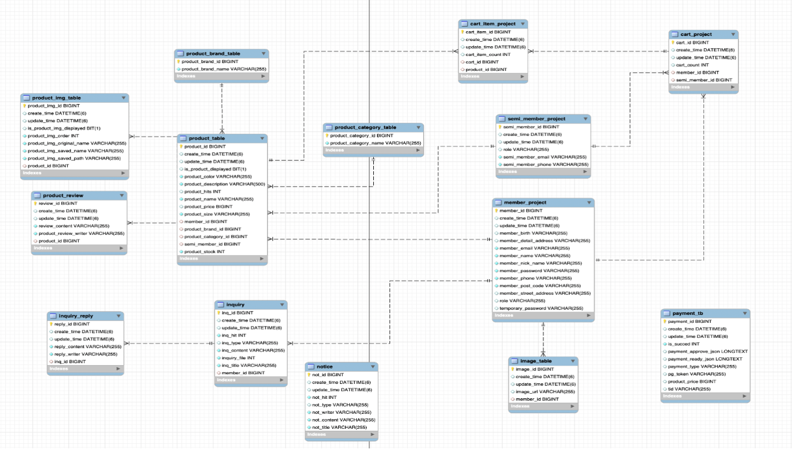
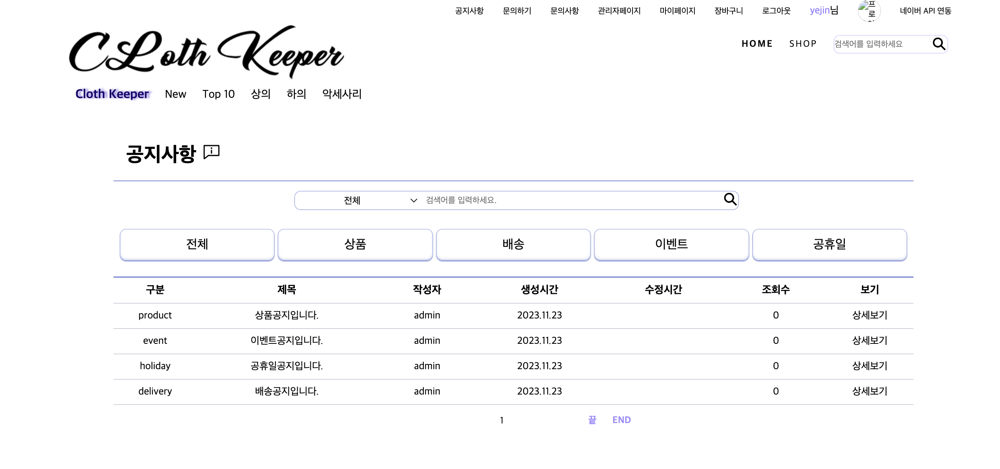
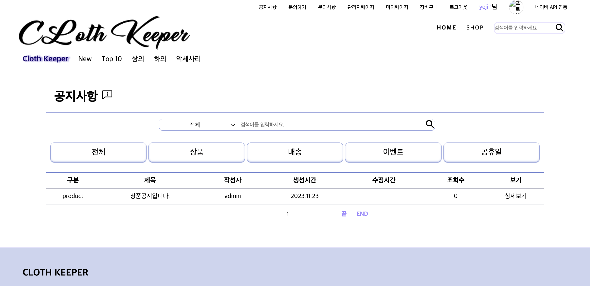

# 쇼핑몰 프로젝트
> SpringBoot 쇼핑몰 & 관리자모드 기반 챗봇 구현 Project
 

# 📍 목차
1. 프로젝트 소개
2. 개발기간
3. 개발환경
4. DB구성
5. 멤버구성 및 기능
 

## 🖥️ 프로젝트 소개
> kream페이지를 밴치마킹한 쇼핑몰 프로젝트입니다.
 

## ⌛️개발기간
* 23.08.25 ~ 23.09.25 (약 1개월 소요)
 

## 🛠️개발환경

 

## ⚙️ DB 구성

 

## 🏃‍♀️ 맴버 구성
#### 김예진 : 게시판CRUD, 상품 제외 디자인

  
📝 게시판

  > 게시판 작성하기

  

  > Controller
  > Service
 
  > 게시판 수정하기

  

  > Controller
  > Service

  > 게시판 상세보기

  

  > Controller
  > Service

  > 게시판 목록보기
   
  |||

  > Controller
  > Service

 
이** : 관리자페이지, 결제
 
송** : 회원 CRUD
 
방** : 댓글
 
박** : 상품 CRUD, 상품 Front
