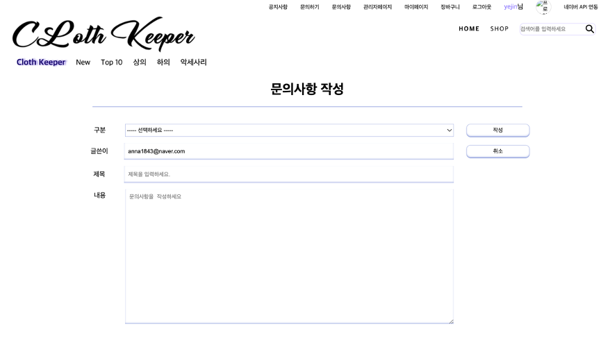
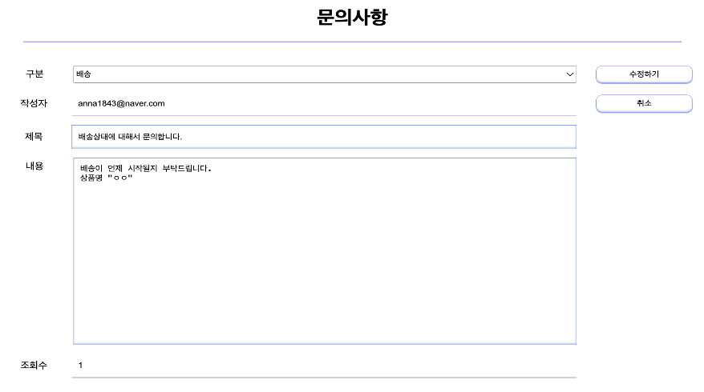
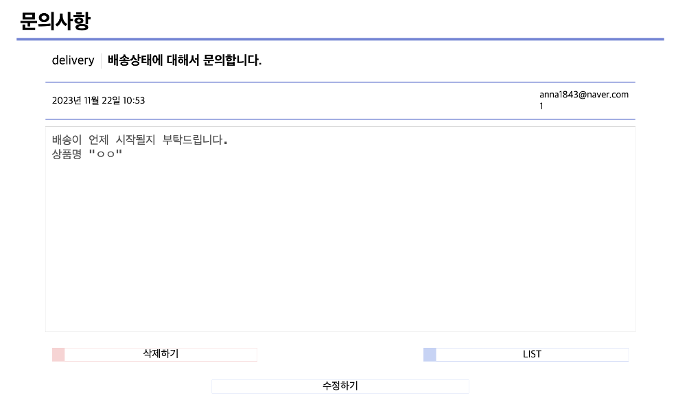

# 쇼핑몰 프로젝트
> SpringBoot 쇼핑몰 & 관리자모드 기반 챗봇 구현 Project
<br>

# 📍 목차
1. 프로젝트 소개
2. 개발기간
3. 개발환경
4. DB구성
5. 멤버구성 및 기능
<br>

## 🖥️ 프로젝트 소개
> kream페이지를 밴치마킹한 쇼핑몰 프로젝트입니다.
<br>

## ⌛️개발기간
* 23.08.25 ~ 23.09.25 (약 1개월 소요)
<br>

## 🛠️개발환경

<br>

## ⚙️ DB 구성

<br>

## 🏃‍♀️ 맴버 구성
#### 김예진 : 게시판CRUD, 상품 제외 디자인

<details>
  <summary>📝 게시판</summary>

  > 게시판 작성하기

  

  > Controller
  
  ```java
  @GetMapping("/write")
  public String getInquiryWrite(InquiryDto inquiryDto, @AuthenticationPrincipal MyUserDetails myUserDetails, @AuthenticationPrincipal SemiMyUserDetails semiMyUserDetails, Model model){
    if(myUserDetails != null) {
      MemberDto member = memberService.detailMember(myUserDetails.getMemberEntity().getMemberId());
      String memberImageUrl = imageService.findImage(member.getMemberEmail()).getImageUrl();
      model.addAttribute("member", member);
      model.addAttribute("memberImageUrl", memberImageUrl);
    } else {
      log.info("member is null");
      log.info("semiMemberId : " + semiMyUserDetails.getSemiMemberEntity().getSemiMemberId());
    }
    return "inquiry/write";
  }
  @PostMapping("/write")
  public String postInquiryWrite(@Validated InquiryDto inquiryDto, BindingResult bindingResult, Model model, @AuthenticationPrincipal MyUserDetails myUserDetails) throws IOException {
    if(bindingResult.hasErrors()){
      return "inquiry/write";
    }
    MemberEntity member = myUserDetails.getMemberEntity(); // 현재 로그인한 사용자의 MemberEntity 가져오기
    int rs = inquiryService.InquiryInsert(inquiryDto, member);
    if(rs==1){
      return "redirect:/inquiry/list?page=0&select=&search=";
    }
    return "index";
  }
  ```
  
  <br>
  
  > Service

  ```java
  @Transactional
  public int InquiryInsert(InquiryDto inquiryDto, MemberEntity memberEntity) throws IOException {
    InquiryEntity inquiryEntity = InquiryEntity.toInquiryEntityInsert(inquiryDto);
    inquiryEntity.setMember(memberEntity); // 현재 로그인한 사용자의 MemberEntity 설정
    Long inquiryId = inquiryRepository.save(inquiryEntity).getInqId();
    Optional<InquiryEntity> optionalInquiryEntity = Optional.ofNullable(inquiryRepository.findById(inquiryId).orElseThrow(() ->{
      return new IllegalArgumentException("문의사항을 찾을 수 없습니다.");
    }));
    if(!optionalInquiryEntity.isPresent()){
      return 0;
    }
    return 1;
  }
  ```
  
  > 게시판 수정하기

  

  > Controller

  ```java
  @GetMapping("/update/{id}")
  public String getInquiryUpdate(@PathVariable("id") Long id, Model model, @AuthenticationPrincipal MyUserDetails myUserDetails){
    myUserDetails.getMemberEntity();
    MemberDto member = memberService.detailMember(myUserDetails.getMemberEntity().getMemberId());
    String memberImageUrl = imageService.findImage(member.getMemberEmail()).getImageUrl();
    InquiryDto inquiryDto = inquiryService.InquiryUpdate(id);
    if(inquiryDto != null){
      model.addAttribute("inquiryDto",inquiryDto);
      model.addAttribute("member", member);
      model.addAttribute("memberImageUrl", memberImageUrl);
      return "inquiry/update";
    }
    model.addAttribute("member", member);
    model.addAttribute("memberImageUrl", memberImageUrl);
    return "redirect:/inquiry/list?page=0&select=&search=";
  }
  @PostMapping("/update/{id}")
  public String postInquiryUpdate(@PathVariable("id") Long id, InquiryDto inquiryDto, Model model, @AuthenticationPrincipal MyUserDetails myUserDetails){
    myUserDetails.getMemberEntity();
    MemberDto member = memberService.detailMember(myUserDetails.getMemberEntity().getMemberId());
    String memberImageUrl = imageService.findImage(member.getMemberEmail()).getImageUrl();
    InquiryDto inquiryDto1 = inquiryService.inquiryUpdateOk(inquiryDto,id);
    model.addAttribute("inquiryDto", inquiryDto1);
    model.addAttribute("member", member);
    model.addAttribute("memberImageUrl", memberImageUrl);
    return "inquiry/detail";
  }
  ```

  <br>

  > Service

  ```java
  public InquiryDto InquiryUpdate(Long id) {
    Optional<InquiryEntity> optionalInquiryEntity = Optional.ofNullable(inquiryRepository.findById(id).orElseThrow(() ->{
      return new IllegalArgumentException("수정할 문의사항이 없습니다.");
    }));
    if(optionalInquiryEntity.isPresent()){
      InquiryDto inquiryDto = InquiryDto.toinquiryDto(optionalInquiryEntity.get());
      return inquiryDto;
    }
    return null;
  }
  @Transactional
  public InquiryDto inquiryUpdateOk(InquiryDto inquiryDto, Long id) { 
    InquiryEntity inquiryEntity = inquiryRepository.findById(id).orElseThrow(()->{
      throw new IllegalArgumentException("수정할 공지사항이 존재하지 않습니다.");
    });
    // InquiryEntity를 업데이트
    InquiryEntity updatedInquiryEntity = InquiryEntity.toInquiryEntityUpdate(inquiryDto);
    updatedInquiryEntity.setMember(inquiryEntity.getMember()); // member 정보 유지
    // 업데이트된 InquiryEntity를 저장
    Long inquiryId = inquiryRepository.save(updatedInquiryEntity).getInqId();
    InquiryEntity inquiryEntity1 = inquiryRepository.findById(inquiryId).orElseThrow(() -> {
      throw new IllegalArgumentException("수정한 공지사항이 존재하지 않습니다.");
    });
    // 업데이트된 InquiryEntity를 사용하여 InquiryDto를 생성하고 반환
    InquiryDto updatedInquiryDto = InquiryDto.toinquiryDto(inquiryEntity1);
      return updatedInquiryDto;
  }
  ```
  
  > 게시판 상세보기

  

  > Controller

  ```java
  @GetMapping("/detail/{id}")
  public String getInquiryDetail(@PathVariable("id") Long id, Model model, @AuthenticationPrincipal MyUserDetails myUserDetails){
    MemberDto member = memberService.detailMember(myUserDetails.getMemberEntity().getMemberId());
    String memberImageUrl = imageService.findImage(member.getMemberEmail()).getImageUrl();
    InquiryDto inquiryDto = inquiryService.InquiryDetail(id);
    if(inquiryDto != null){
      model.addAttribute("inquiryDto", inquiryDto);
      model.addAttribute("member", member);
      model.addAttribute("memberImageUrl", memberImageUrl);
      return "inquiry/detail";
    }
    return "redirect:/inquiry/list?page=0&select=&search=";
  }
  ```
  
  <br>
  
  > Service

  ```java
  @Transactional
  public InquiryDto InquiryDetail(Long id) {
    InquiryHit(id);
    InquiryEntity inquiryEntity = inquiryRepository.findById(id).orElseThrow(IllformedLocaleException::new);
    return InquiryDto.builder()
          .inqId(inquiryEntity.getInqId())
          .inquiryTitle(inquiryEntity.getInquiryTitle())
          .inquiryContent(inquiryEntity.getInquiryContent())
          .inqType(inquiryEntity.getInqType())
          .CreateTime(inquiryEntity.getCreateTime())
          .UpdateTime(inquiryEntity.getUpdateTime())
          .inqHit(inquiryEntity.getInqHit())
          .memberEmail(inquiryEntity.getMember().getMemberEmail()) // 송원철 / memberEmail 추가
          .build();
  }
  ```

  > 게시판 목록보기
  
  <br>

  |전체보기|상품보기|
  |----|----|
  |||

  > Controller

  ```java
  @GetMapping("/list/{type}")
  public String getNoticeLis( @PageableDefault(page = 0, size = 10, sort = "notId",direction = Sort.Direction.DESC)Pageable pageable, Model model, @PathVariable("type") String type,
            @AuthenticationPrincipal MyUserDetails myUserDetails){
    if (myUserDetails != null) {
      MemberDto member = memberService.detailMember(myUserDetails.getMemberEntity().getMemberId());
      String memberImageUrl = imageService.findImage(member.getMemberEmail()).getImageUrl();
      model.addAttribute("member", member);
      model.addAttribute("memberImageUrl", memberImageUrl);
    }
    // type을 가져오고 페이징
    Page<NoticeDto> noticeList = noticeService.noticeList(type, pageable);
    if (noticeList==null) {
      throw new RuntimeException("list none");
    }
    Long totalCount = noticeList.getTotalElements();
    int totalPage = noticeList.getTotalPages();
    int pageSize = noticeList.getSize();
    int nowPage = noticeList.getNumber();
    int blockNum = 10;
    int startPage = (int)((Math.floor(nowPage/blockNum)*blockNum) + 1 <= totalPage ? (Math.floor(nowPage/blockNum)*blockNum) + 1 : totalPage);
    int endPage = (startPage + blockNum - 1 < totalPage ? startPage + blockNum - 1 : totalPage);
    model.addAttribute("noticeList", noticeList);
    model.addAttribute("startPage", startPage);
    model.addAttribute("endPage", endPage);
    return "notice/list";
  }
  ```
  
  <br>
  
  > Service

  ```java
  @Transactional
  public Page<NoticeDto> noticeList(String type, Pageable pageable) {
    Page<NoticeEntity> noticeEntities = noticeRepository.findByNotType(type, pageable); // not_type에 해당하는 값만 출력
    noticeEntities.getNumber();
    noticeEntities.getTotalElements();
    noticeEntities.getTotalPages();
    noticeEntities.getSize();
    Page<NoticeDto> noticeDtoPage = noticeEntities.map(NoticeDto::tonoticeDto);
    return noticeDtoPage;
  }
  ```

  <br>

  > Html
  
  ```html
  <div class="type">
                <ul>
                    <li>
                        <span>
                            <a th:href="@{/notice/list(page=0 ,search=${param.search} ,select=${param.select})}">전체</a>
                        </span>
                    </li>
                    <li>
                        <span>
                            <a th:href="@{/notice/list/{type}(type='product')}">상품</a>
                        </span>
                    </li>
                    <li>
                        <span>
                            <a th:href="@{/notice/list/{type}(type='delivery')}">배송</a>
                        </span>
                    </li>
                    <li>
                       <span>
                            <a th:href="@{/notice/list/{type}(type='event')}">이벤트</a>
                        </span>
                    </li>
                    <li>
                        <span>
                            <a th:href="@{/notice/list/{type}(type='holiday')}">공휴일</a>
                        </span>
                    </li>
                </ul>
        </div>
  ```

</details>

<br>
이** : 관리자페이지, 결제
<br>
송** : 회원 CRUD
<br>
방** : 댓글
<br>
박** : 상품 CRUD, 상품 Front
